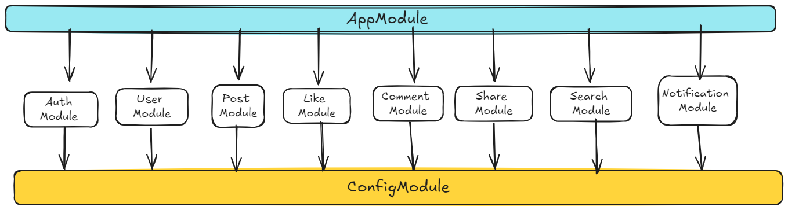

<p align="center">
  <a href="http://nestjs.com/" target="blank">
    
  </a>
  &nbsp;&nbsp;
  <a href="https://graphql.org/" target="blank">
    
  </a>
  &nbsp;&nbsp;
  <a href="https://www.mongodb.com/" target="blank">
    
  </a>
  &nbsp;&nbsp;
  <a href="https://www.docker.com/" target="blank">
    
  </a>
</p>

[circleci-image]: https://img.shields.io/circleci/build/github/nestjs/nest/master?token=abc123def456
[circleci-url]: https://circleci.com/gh/nestjs/nest

  <p align="center">Social Media GraphQL API built with <a href="https://nestjs.com/" target="_blank">Nest.js</a> framework for building efficient and scalable server-side applications.</p>
    <p align="center">

## Description

This is a social media API built with Nest.js, MongoDB, GraphQL, and Docker. It provides a GraphQL API for Social Media Application.

## Tech

- Node.js
- Nest.js
- MongoDB/Mongoose
- GraphQL
- Docker + Docker Compose

## Nest Modules Architecture



## MongoDB Schema

.png)

## Features As A Service

- Auth Service :

- User Service :
- Post Service :
- Comment Service :
- Share Service :
- Like Service :
- Notification Service :

## GraphQL Resolvers

### Queries

- getUserprofile

- getFriends  

- getNotifications

- postsFeed

- post

- comments

- comment

- share

- searchUser

- searchPosts

- searchCaptions

### Mutations

- addOrUpdateBio

- sendFriendRequest

- acceptFriendRequest

- cancelFriendRequest

- markNotificationAsRead

- login

- register

- createPost

- updatePost

- removePost

- createComment

- updateComment

- removeComment

- createLike

- removeLike

- createShare

- updateShare

- removeShare

## Subscription

- notificationAdded

## Installation

```bash
npm install
```

## Running the app

```bash
# development
$ npm run start

# watch mode
$ npm run start:dev

# production mode
$ npm run start:prod
```

## Using Docker Compose

```bash

docker-compose up --build

```

## Support

Nest is an MIT-licensed open source project. It can grow thanks to the sponsors and support by the amazing backers. If you'd like to join them, please [read more here](https://docs.nestjs.com/support).

## License

Nest is [MIT licensed](LICENSE).
